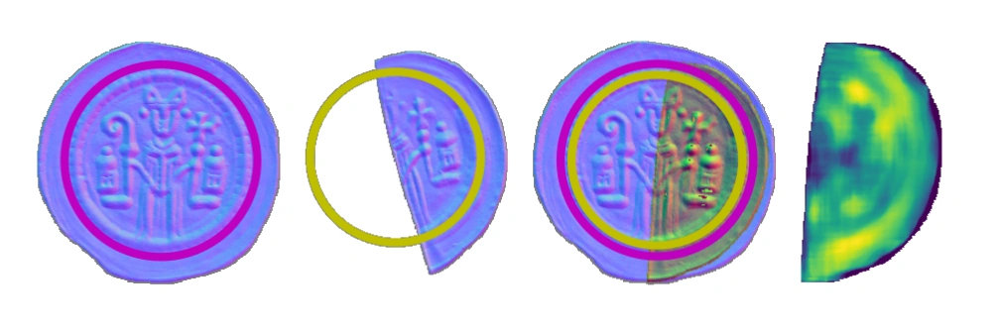
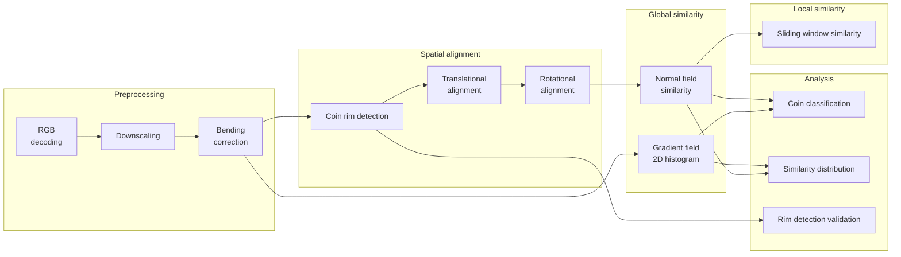

# Medieval coin comparison

Similarity measures for comparing normal maps of medieval coins previously
acquired using photometric stereo analysis [1,2].


## Overview

An overview of the coin processing pipeline is presented in the Figure below.
Data is flowing from left to right. Following a preprocessing step, coins are
spatially aligned before various global and local similarity measures are
computed. Finally, the results are analysed by their similarity distributions
and using a coin classification task.




## Usage

A Linux system with Python and Conda is needed to run the coin processing
pipeline.

1. Create and activate a new conda environment
```
conda env create -f environment.yml
conda activate coins
```

2. Run the whole pipeline
```
bash run.sh
```

3. Intermediate processing output are stored in directory `output/`, and
resulting data and figures from analysis are saved in directory `results/`.


## References

[1] Original data publication (https://doi.org/10.5334/joad.116)\
[2] Original data repository (https://doi.org/10.24406/fordatis/210)


## License

This software is licensed under the MIT license. See LICENSE.txt for details.

